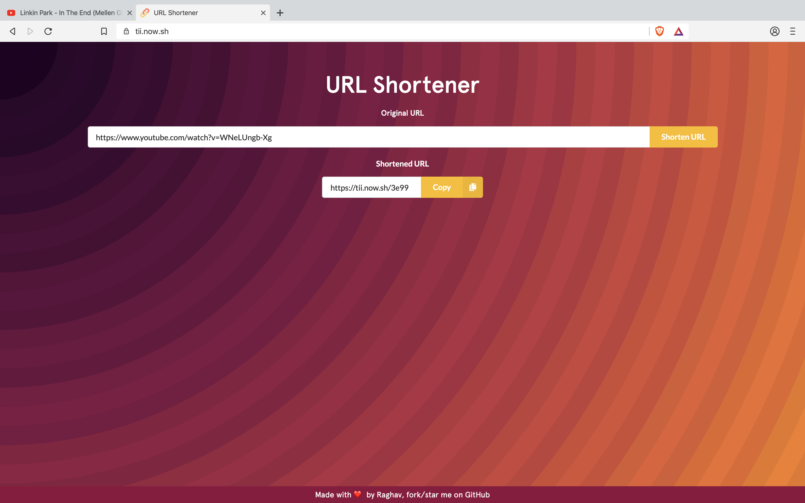
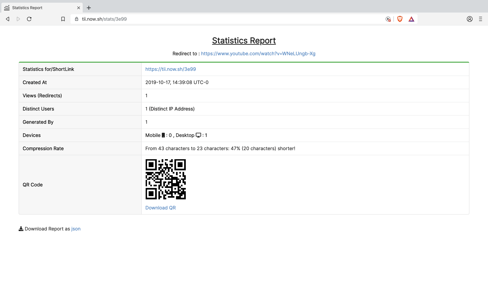
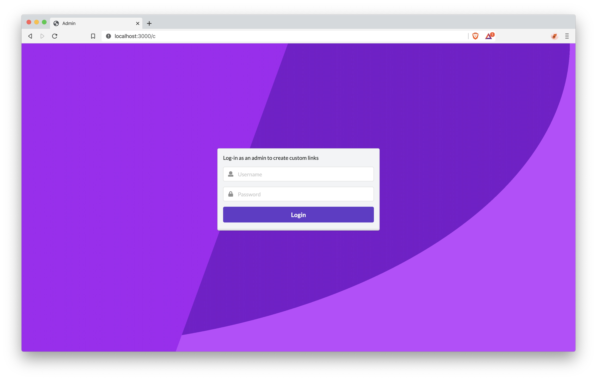
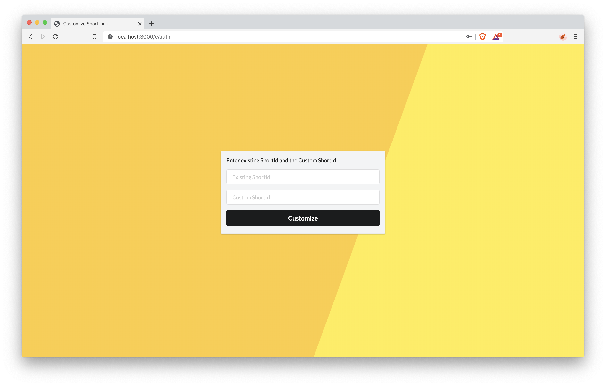

<h1 align="center">Welcome to ShortLink 👋</h1>
<p>
  
  <a href="https://github.com/raghav4/ShortLink#readme" target="_blank">
    
  </a>
  <a href="https://github.com/raghav4/ShortLink/graphs/commit-activity" target="_blank">
    
  </a>
  <a href="https://github.com/raghav4/ShortLink/blob/master/LICENSE" target="_blank">
    
  </a>
</p>

> URL Shortener service built with NodeJS, ExpressJS, MongoDB, PugJs, etc

### 🏠 [Homepage](https://github.com/raghav4/ShortLink#readme)

### ✨ [Demo](https://tii.now.sh)

## Install

```sh
npm install
```

## Usage

```sh
npx nodemon
```

## Use Environment Variables

```sh
# Create a .env file and add the environment variables
DB_URI = mongodb://localhost/url-shortener
jwtPrivateKey = jwtKey123
```

> Sample : [.env.example](https://github.com/raghav4/ShortLink/blob/master/.env.example)

## Screenshots

### Home



### Statistics



### Admin Login



### Customize ShortId



## Author

👤 **Raghav Sharma**

- Website: https://raghavsharma.xyz
- Github: [@raghav4](https://github.com/raghav4)
- LinkedIn: [@rsx](https://linkedin.com/in/rsx)

## Show your support

Give a ⭐️ if this project helped you!

## 📝 License

Copyright © 2020 [Raghav Sharma](https://github.com/raghav4).<br />
This project is [MIT](https://github.com/raghav4/ShortLink/blob/master/LICENSE) licensed.

---

This README was generated with ❤️ by [readme-md-generator](https://github.com/kefranabg/readme-md-generator)\_
