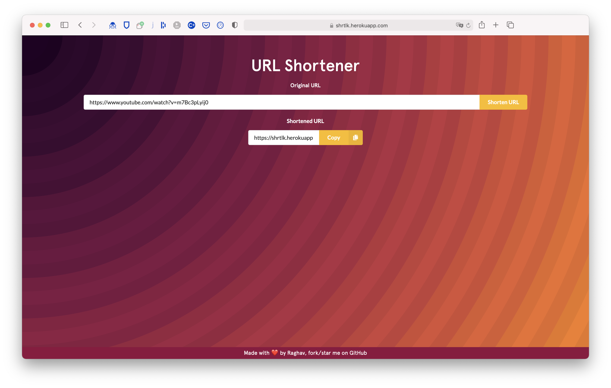
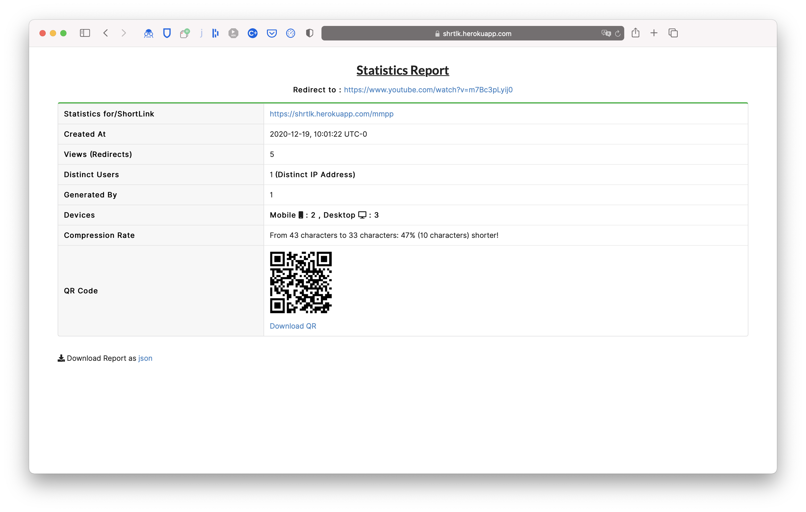
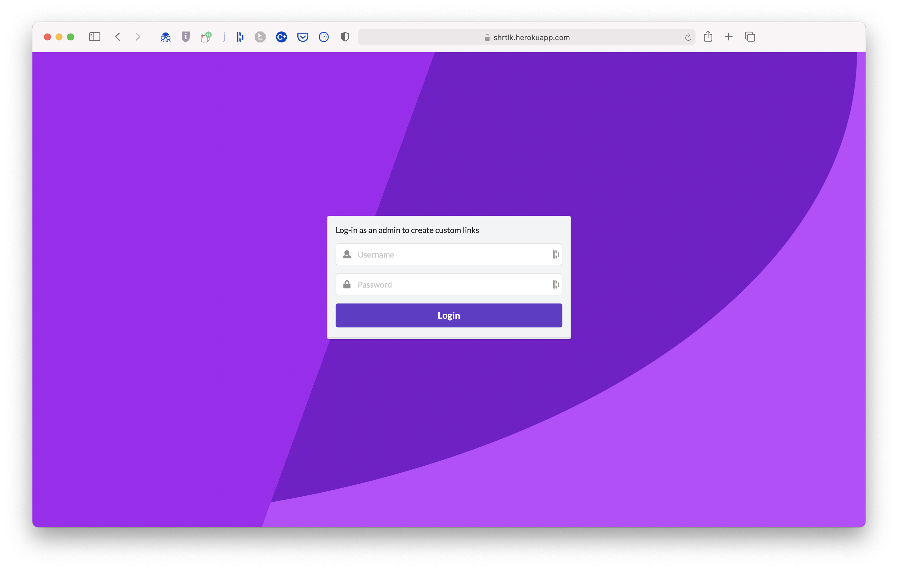
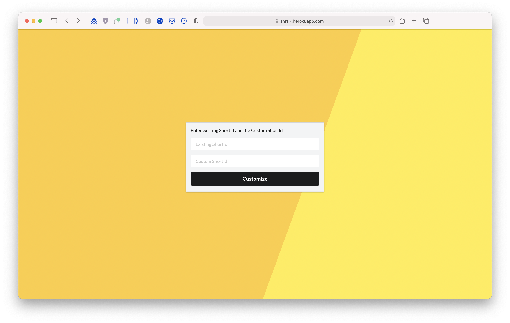

<h1 align="center">Welcome to ShortLink 👋</h1>

  
  
  
  
  

> URL Shortener service built with NodeJS, ExpressJS, MongoDB, PugJs, etc

### 🏠 [Homepage](https://github.com/raghav4/ShortLink#readme)

### ✨ [Demo](https://shrtlk.herokuapp.com)

## Steps to install and Run

1. Make sure `node` is installed in your machine
2. Run `npm install` command after opening the repository
3. Create a `.env` file similar to `.env.example` present in the repository.
4. Run `npm run dev` command to run the project in localhost.
5. For registering new admin run `npm run create_admin`.

## Screenshots

### Home

### Statistics

### Admin Login

### Customize ShortId

## Author

👤 **Raghav Sharma**

- Website: https://raghavsharma.xyz
- Github: [@raghav4](https://github.com/raghav4)
- LinkedIn: [@rsx](https://linkedin.com/in/rsx)

## Show your support

Give a ⭐️ if this project helped you!

## 📝 License

Copyright © 2020 [Raghav Sharma](https://github.com/raghav4). 
This project is [MIT](https://github.com/raghav4/ShortLink/blob/master/LICENSE) licensed.

---

This README was generated with ❤️ by [readme-md-generator](https://github.com/kefranabg/readme-md-generator)\_
